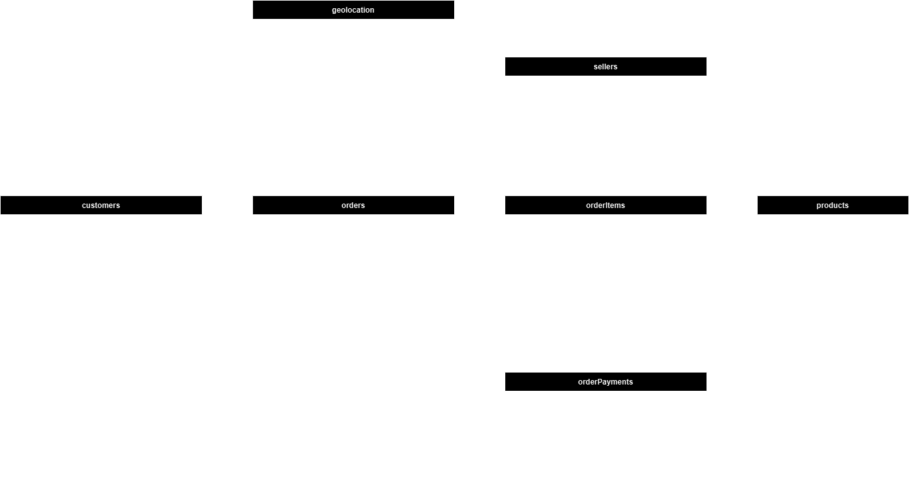
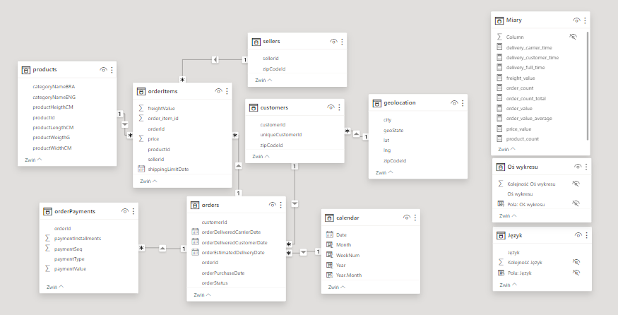
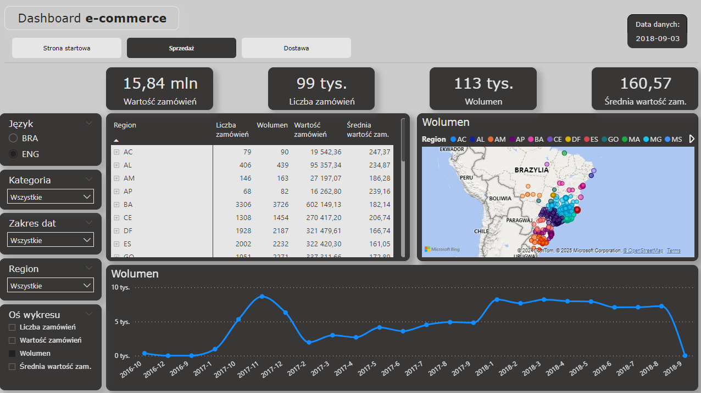
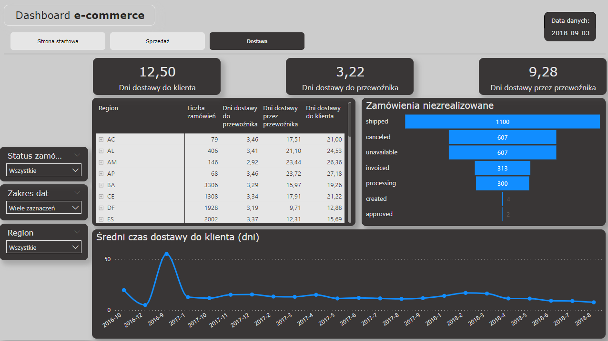

# Dashboard e-commerce

## Cel projektu

Celem raportu sprzedażowego jest umożliwienie śledzenia wyników sprzedaży i dostaw w czasie rzeczywistym, identyfikacja kluczowych trendów oraz wspieranie podejmowania decyzji biznesowych.

## Zakres projektu

1.  Analiza wymagań biznesowych
    1.  Pytania biznesowe:
        1.  Jakie są całkowite przychody firmy w wybranym okresie?
        2.  Które regiony generują najwyższe przychody?
        3.  Jakie produkty sprzedają się najlepiej w poszczególnych regionach?
        4.  Jak zmieniały się wyniki sprzedaży na przestrzeni miesięcy?
        5.  Ile czasu zajmuje dostawa zamówienia do klienta?
    2.  Kluczowe wskaźniki (KPI)
        1.  Całkowite przychody
        2.  Średnia wartość zamówienia
        3.  Wolumen sprzedaży
        4.  Czas dostawy do klienta
2.  Przygotowanie źródeł danych
    1.  Architektura przepływu danych
       
    3.  Struktura bazy danych
       
3.  Tworzenie modelu danych
4.  Wizualizacja danych
    1.  Strona Sprzedaży
       
    3.  Strona Dostawy
       

## Technologie i narzędzia

1.  Podstawowe narzędzia i technologie wykorzystane do utworzenia dashboardu
    1.  **Excel** \- dane źródłowe w formie plików .csv
    2.  **Python** \- przetworzenie i transformacja danych, oraz zapis do bazy MySQL
    3.  **SQL** \- pozyskanie danych z bazy MySQL
    4.  **DAX** \- miary i kalkulacje
    5.  **Power BI** - publikacja raportu
  
